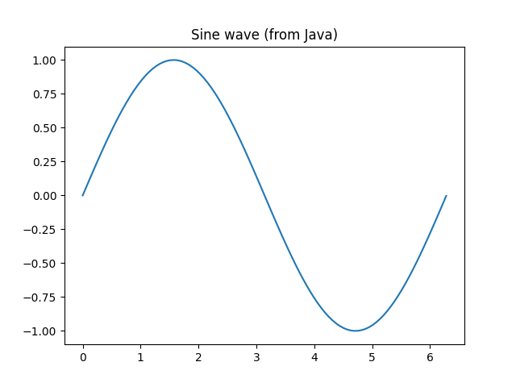

# WrapPyJ - Auto‑generate Java wrappers for any Python library — seamless, zero‑glue interoperability.

WrapPyJ is a Java wrappers generator for Python libraries, enabling seamless integration of Python functionality within Java applications. 
This project consists of generator module that work together to provide a complete solution for Python-Java interoperability.

[](https://central.sonatype.com/artifact/tech.thegamedefault.wrappyj/generator)

```xml
<dependency>
    <groupId>tech.thegamedefault.wrappyj</groupId>
    <artifactId>generator</artifactId>
    <version>1.0.0</version>
</dependency>
```

## WrapPyJ Why ? 
<div>
  
</div>


## 🏗️ Project Architecture

WrapPyJ is organized as a multi-module Maven project with the following structure:

```
WrapPyJ/
├── generator/                    # Core wrapper generation engine
├── example-generator/           # Example of generating wrappers
├── example-wrapper-usage/       # Example of using generated wrappers
└── src/main/java/.../generated/ # Generated wrapper classes
```

## 📦 Module Overview

### 1. **Generator Module** (`generator/`)
**Core Engine for Python Library Analysis and Java Wrapper Generation**

#### Key Components for clients:

- **`WrapPyJGenerator`**: Main entry point for wrapper generation
- **`WrapPyJApp`**: To be used once Java wrappers are generated, to initialize required dependencies.

#### Key Components for devs:

- **`PythonRuntimeManager`**: Handles Python runtime initialization and dependencies
- **`PythonAnalyser`**: Analyzes Python library structure and metadata
- - **`WPJInterpreter`**: Manages Python interpreter instances via JEP
- **`JavaWrapperGenerator`**: Generates Java wrapper classes using JavaPoet


#### Features:
- **Automatic Analysis**: Scans Python libraries to understand their structure
- **Java Code Generation**: Creates type-safe Java wrapper classes
- **Dependency Management**: Handles Python package dependencies
- **Cross-Platform Support**: Works on Linux, macOS, and Windows

#### Dependencies:
- **[JEP](https://github.com/ninia/jep) (Java Embedded Python)**: For Python-Java interop
- **[JavaPoet](https://github.com/square/javapoet)**: For Java code generation
- **Spring Boot**: For application framework
- **Jackson**: For JSON processing
- **Lombok**: For reducing boilerplate code

#### Usage:
```java
List<GeneratorRequest> requests = List.of(
    GeneratorRequest.builder()
        .importDependencyName("numpy")
        .library("numpy")
        .outputPath("./src/main/java")
        .basePackage("com.example.wrappers")
        .build()
);

WrapPyJGenerator.generate(requests);


WrapPyJApp.init(List.of("pandas", "numpy", "matplotlib"));
```

---

### 2. **Example Generator Module** (`example-generator/`)
**Demonstration of Wrapper Generation Process**

This module showcases how to use the generator to create Java wrappers for popular Python libraries.

#### What it demonstrates:
- **Multi-library Generation**: Generates wrappers for numpy, pandas, and matplotlib
- **Selective Generation**: Shows how to include only specific functions/classes
- **Build Integration**: Demonstrates Maven integration for automated generation

#### Generated Libraries:
- **NumPy**: Scientific computing library wrapper
- **Pandas**: Data manipulation and analysis wrapper  
- **Matplotlib**: Plotting and visualization wrapper

#### Key Features:
- **Automated Build Process**: Wrappers are generated during Maven compilation
- **Customizable Output**: Configurable output paths and package names
- **Selective Inclusion**: Can generate wrappers for specific parts of libraries

#### Example Configuration:
```java
List<GeneratorRequest> requests = List.of(
    GeneratorRequest.builder()
        .importDependencyName("numpy")
        .library("numpy")
        .build(),
    GeneratorRequest.builder()
        .importDependencyName("pandas")
        .library("pandas")
        .build(),
    GeneratorRequest.builder()
        .importDependencyName("matplotlib")
        .library("matplotlib.pyplot")
        .build()
);
```

---

### 3. **Example Wrapper Usage Module** (`example-wrapper-usage/`)
**Demonstration of Using Generated Wrappers**

This module shows how to use the generated Java wrappers in real applications, providing practical examples of Python-Java integration.

#### Demonstrations:

##### **NumPy Integration** (`TheNumpy.java`)
```java
// Perform mathematical operations using NumPy
Object result = JNumpy.sum(List.of(1, 2, 3, 4, 5));
long actual = ((long[]) result)[0];
```

##### **Pandas Data Analysis** (`ThePandas.java`)
```java
// Read CSV and perform data analysis
JDataFrame df = new JDataFrame(JPandas.read_csv(CSV_PATH));
Object head = df.head();
Object desc = df.describe();
Object groupBy = new JDataFrame(df.groupby("active")).sum();
```

##### **Matplotlib Visualization** (`TheMatplotlibPyplot.java`)
```java
// Create plots and save images
Object xs = JNumpy.linspace(0, 6.28, 100);
Object ys = JNumpy.sin(xs);
JPyplot.plot(xs, ys);
JPyplot.title("Sine wave (from Java)");
JPyplot.savefig("./sine.png");
```
<div align="left">
  
</div>

#### Key Features:
- **Spring Boot Integration**: Shows how to integrate wrappers in Spring applications
- **Real-world Examples**: Practical use cases for data analysis and visualization
- **Resource Management**: Proper initialization and cleanup of Python interpreters
- **Error Handling**: Demonstrates robust error handling patterns

---

## 🚀 Getting Started

### Prerequisites
- Java 19 or higher
- Maven 3.6+
- Python 3.10+ (embedded in the project)

### Quick Start

1. **Clone the repository**
   ```bash
   git clone <repository-url>
   cd WrapPyJ
   ```

2. **Build the project**
   ```bash
   mvn clean install
   ```

3. **Generate wrappers** (optional - already included)
   ```bash
   cd example-generator
   mvn clean compile
   ```
   
   > **Note**: The wrapper generation uses the Maven exec plugin to automatically run during the compile phase. See the [Custom Wrapper Generation](#custom-wrapper-generation) section for details on setting up your own generator.

4. **Run the example application**
   ```bash
   cd example-wrapper-usage
   mvn spring-boot:run
   ```

### Custom Wrapper Generation

The recommended way to generate wrappers is using the Maven exec plugin, as demonstrated in the `example-generator` module.

#### Step 1: Create a Generator Class

Create a Java class similar to `WrapPyJGeneratorExample`:

```java
package com.yourcompany.generator;

import java.util.List;
import tech.thegamedefault.wrappyj.generator.WrapPyJGenerator;
import tech.thegamedefault.wrappyj.generator.WrapPyJGenerator.GeneratorRequest;

public class YourLibraryGenerator {
    
    private static final List<GeneratorRequest> GENERATOR_REQUESTS = List.of(
        GeneratorRequest.builder()
            .importDependencyName("your-library")
            .library("your.library.module")
            .outputPath("./src/main/java")
            .basePackage("com.yourcompany.wrappers")
            .includeOnly(List.of("function1", "function2")) // Optional
            .build()
    );

    public static void main(String[] args) {
        WrapPyJGenerator.generate(GENERATOR_REQUESTS);
    }
}
```

#### Step 2: Configure Maven Exec Plugin

Add the exec-maven-plugin to your `pom.xml`:

```xml
<plugin>
    <groupId>org.codehaus.mojo</groupId>
    <artifactId>exec-maven-plugin</artifactId>
    <executions>
        <execution>
            <phase>compile</phase>
            <goals>
                <goal>java</goal>
            </goals>
            <configuration>
                <mainClass>com.yourcompany.generator.YourLibraryGenerator</mainClass>
                <classpathScope>compile</classpathScope>
            </configuration>
        </execution>
    </executions>
</plugin>
```

#### Step 3: Run the Generation

Execute the generation as part of your Maven build:

```bash
mvn clean package exec:java
```

Or run it during the compile phase:

```bash
mvn clean compile
```

#### Alternative: Direct Java Execution

You can also run the generator directly in Java code:

```java
List<GeneratorRequest> requests = List.of(
    GeneratorRequest.builder()
        .importDependencyName("your-library")
        .library("your.library.module")
        .outputPath("./src/main/java")
        .basePackage("com.yourcompany.wrappers")
        .includeOnly(List.of("function1", "function2")) // Optional
        .build()
);

WrapPyJGenerator.generate(requests);
```

## 🔧 Configuration

### Generator Configuration
- **Output Path**: Where generated Java files will be placed
- **Base Package**: Java package name for generated classes
- **Include Only**: Specific functions/classes to include (optional)
- **Import Dependencies**: Python package names to install

### Runtime Configuration
- **Python Interpreter**: Managed automatically by JEP
- **Memory Management**: Automatic cleanup of Python objects
- **Error Handling**: Comprehensive exception handling

## 📊 Generated Wrapper Structure

Generated wrappers follow a consistent pattern:

```
generated/
├── library_name/
│   ├── JLibraryName.java          # Main library wrapper
│   ├── JClassName.java            # Class wrappers
│   └── JFunctionName.java         # Function wrappers
```

Each wrapper provides:
- **Type-safe method calls** to Python functions [** Not supported for all libraries, part of next milestone]
- **Automatic parameter conversion** between Java and Python types
- **Exception handling** for Python errors
- **Resource management** for Python objects

## 🛠️ Development Workflow

1. **Analysis Phase**: PythonAnalyser scans the target library
2. **Generation Phase**: JavaWrapperGenerator creates Java classes
3. **Integration Phase**: Generated wrappers are used in Java applications
4. **Runtime Phase**: WPJInterpreter manages Python execution

## 🔍 Troubleshooting

### Common Issues:
- **Python Import Errors**: Ensure Python packages are installed
- **Memory Issues**: Check JEP memory configuration
- **Type Conversion**: Verify parameter types match expected Python types

### Debug Mode:
Enable debug logging to see detailed generation and execution information.

## 📈 Performance Considerations

- **Lazy Loading**: Python modules are loaded only when needed
- **Object Pooling**: Reuses Python interpreter instances
- **Memory Management**: Automatic cleanup of Python objects
- **Batch Operations**: Efficient handling of multiple operations

## 🔒 Security

- **Sandboxed Execution**: Python code runs in controlled environment
- **Input Validation**: Automatic validation of parameters
- **Resource Limits**: Configurable limits on Python operations

## 📝 License

This project is licensed under the terms specified in the LICENSE file.

## 🤝 Contributing

Contributions are welcome! Please see our [Contributing Guidelines](CONTRIBUTING.md) for detailed information on:

- 🛠️ Development setup and environment configuration
- 📝 Coding standards and best practices
- 🧪 Testing guidelines and requirements
- 🔄 Pull request process and review checklist
- 🐛 Issue reporting templates
- 🚀 Release process and versioning
- 👥 Community guidelines and code of conduct

We appreciate all contributions, from bug reports to feature requests to code improvements!

## 📞 Support

For support and questions:
- Create an issue in the repository
- Check the documentation
- Review the example modules for usage patterns

---

<div>
   
</div>

**WrapPyJ** - Auto‑generate Java wrappers for any Python library — seamless, zero‑glue interop.